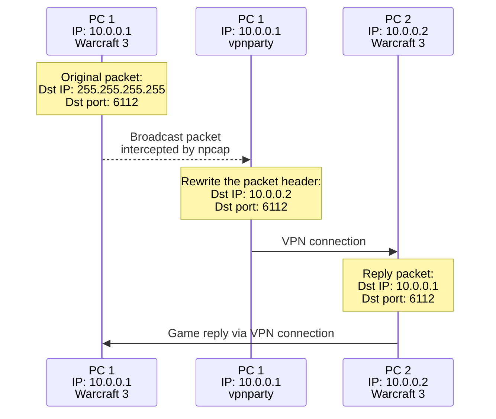
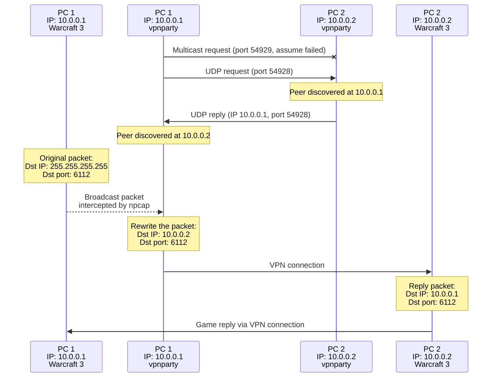

# vpnparty

A LAN party via VPN. Allows games to discover each other through VPN like if they were in local network.

## Verified games

| Game               | Version          | Port  | Status | Note    |
| :----------------- | :--------------- | ----: | ------ | :------ |
| Titan Quest        | 2.10.21415       | 42801 | ✅     |         |
| Torchlight 2       | 1.25.9.5         |  4549 | ✅     |         |
| Warcraft 3         | 1.26.0.6410      |  6112 | ✅     | Original (not reforged) Frozen Throne and Reign of Chaos        |
| Chicken invaders 5 | 5.0.0.0          | 23016 | ❌     | I suspect that game has checks whether the packet is broadcast. |

## How to use

1. Download and install latest [Npcap](https://npcap.com/#download). Tested with versions 1.79 and 1.80. Any compatible should fit.
**Important!** Select `Install Npcap in WinPcap API-compatible Mode` checkbox!
2. Compile (or get somewhere) binaries. See instruction below.
3. Add vpnparty to your firewall exceptions. It needs UDP ports 54928 and 54929 by default.
4. Run vpnparty without arguments. Just double-click. Should work as is.

### CLI options

You can adapt application behavior to your needs. Let's see some examples:\
`.\vpnparty --help` shows detailed help message with examples.\
`.\vpnparty -b 10.0.0.15 10.0.0.22` manually specify peer IP addresses.\
`.\vpnparty -b 10.0.0.15 10.0.0.22 --no-multicast --no-udping` if you know all your peers (let's say there are 3 players), feel free to disable both discovery mechanisms as redundant.\
`.\vpnparty --monochrome` is useful if your command line doesn't support color output.\
`.\vpnparty -p 7654` retransmits only broadcast packets with destination port 7654. Useful if you know exact port that your game uses. By default all broadcast packets are retransmitted, which might be not desired. One more option is `-p known`, which is the synonym to `-p 4549 6112 42801`. See those ports in `Verified games` section.\
`.\vpnparty -v=1` to see debug messages. Set `-v=2` to see all processed packets. Useful for debug.

## How it works

Expert option: specify friend's IP manually, disable discovery protocols. Your friend doesn't need to run `vpnparty` at all.
`.\vpnparty.exe -b 10.0.0.2 --no-multicast --no-udping`



Regular option: no arguments, `vpnparty` runs on both sides, rely on autodiscovery.
`.\vpnparty.exe`



## How to compile

```bash
git clone git@github.com:tvladyslav/vpnparty.git
cd vpnparty
cargo build --release
cargo clippy
```

`target\release` will contain `generator.exe` and `vpnparty.exe`.
- generator.exe is the debug tool. It sends 2 broadcast packets (to ports 4549 and 6112) every second. See troubleshooting section for details.
- vpnparty.exe is the application that you need.

## Troubleshoot

Q: `wcap.dll was not found`\
A: Reinstall npcap and remember to select `Install Npcap in WinPcap API-compatible Mode` checkbox.

Q: I see the `There are active virtual network adapters in your system.` warning.\
A: Please follow recommendations of the warning. As alternative, go to `Control Panel\Network and Internet\Network Connections` and disable devices with "v" prefix (like vEthernet). Virtual devices can capture game packets, they won't reach `vpnparty` and your peer as the consequence.

Q: I run application but still can't join friend's game lobby. Why?\
A: Several suggestions:

1. Go to `Control Panel\System and Security\Windows Defender Firewall\Allowed apps` and allow `vpnparty`. Allow the app in any other firewall in your system.
2. Make sure that `vpnparty` discovered the peer. You should see the line like `<IP> joined the party!`. `vpnparty` can't resend packets to nowhere.
3. Turn on packet tracing using `.\vpnparty -v=2` flag. You should see all captured packets, where first letter denotes: B = resent game-related broadcast packet, M = multicast peer discovery, U = UDP peer discovery.

## Acknowledgements

Thanks [Ratmir Karabut](https://github.com/rkarabut) and his [udp-broadcast-tunnel](https://github.com/rkarabut/udp-broadcast-tunnel) for inspiration.

## License

GNU GPLv3